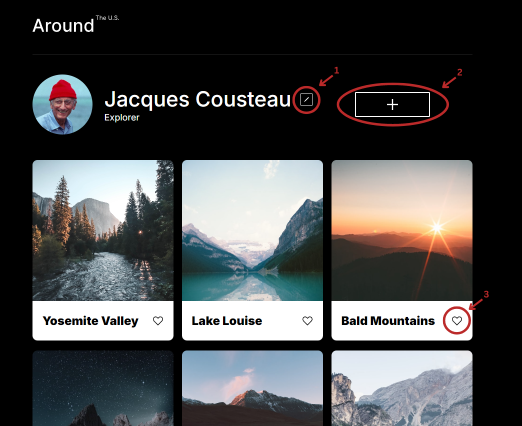
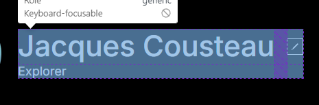
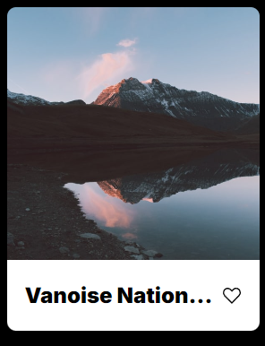
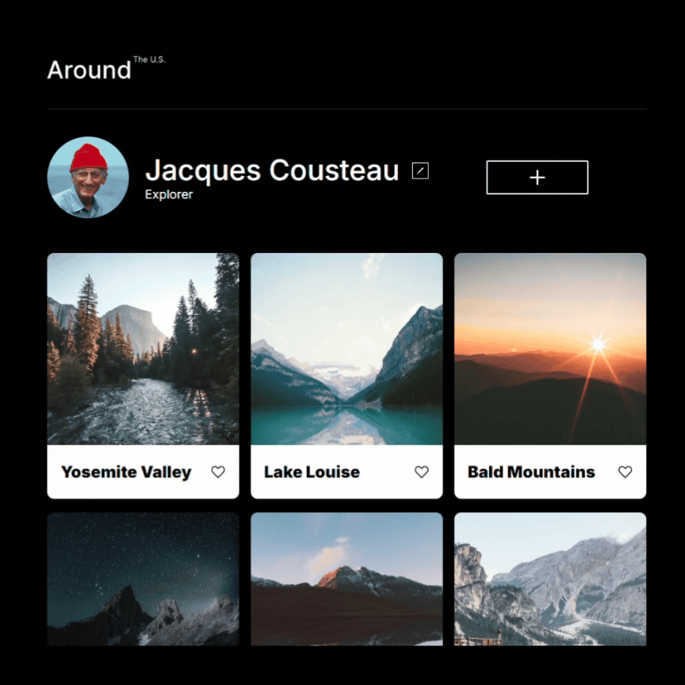

# Project 3: Around The U.S.

## Overview  

* [Description](#description)
* [Project Features](#project-features)
* [GitHub](#github-pages-link)
* [Video](#video-link)
  
## Description
  
This project was created using **HTML**, **CSS**, and **JavaScript** in accordance with the [Figma design](https://www.figma.com/design/JFPhASqvZ5pBjQV2ouUlim/Sprint-5_-Around-The-U.S.-_-desktop-%2B-mobile-(Copy)?node-id=1-2&node-type=frame&t=BKnnPhQKe9XbrKrr-0) and brief provided by TripleTen. \
\
The webpage allows users to:

1. Edit their own personal profile
2. Add and remove images to their profile
3. Like other users' photos
\
\

\
\
This project featueres an adaptable webpage optimized for screen widths ranging from **desktop**(1280px) to **mobile**(320px). 

## Project Features   
### Responsive Layout
#### To accomodate a variety of screen widths, the webpage has a responsive layout


  * **Grid and flexbox** \
    Both ```flex``` and ```grid``` values were used to create a dynamic layout. The profile portion of the webpage utilized both of these. \
     ```flex``` was used when elements only needed to organized along one axis while ```grid``` was used when elements needed to be organized on two axes. 
      - There are three elements in the profile block: the profile image, profile information, and the add button.\
        To have them display as a row in the desktop view and later dispayed as a column in mobile view, ```flex``` was the appropriate property to use.\
        \
         \
        *The three sections are displayed along only one axis*      
      - In contrast, the profile information section has three elements which are organized along two axes: the profile name, edit button, and profile description. \
        The ```grid-template-areas``` property was used to organize them in the appropriate layout. \
        \
        \
        *The three sections are displayed along two axes* 

  * **Max-width** \
    Max-width was frequently used to prevent elements from expanding too much within t he viewport while also allowing them to scale down when the screen size adjsuts.
    
  * **Media Queries**
  Media queries in this project provide specific instruction as to what properties are to be affect at which width.\
  Below is an example of a media query for the profile block and subsequent elements.\

```
@media screen and (max-width: 597px) {
 .profile {
  flex-direction: column;
  justify-content: space-around;
  margin: 19px auto 0;
  max-width: 282px;
 }
}
 ```
  * **Hidden Text Overflow** \
    There are several places within the webpage where users wil be able to add and edit their own text: profile name, profile description, and image captions. This can lead to text overflow. To create a more visually appealing appearance when this happens, the following code was applied to the appropraite blocks/elements:

    ```
    .block {
      text-overflow: ellipsis;
      white-space: nowrap;
      overflow: hidden;
    }
    ```
    Resulting in the follwing visual output:\
    

### Hover States 
The edit profile, add image, and like image buttons all feature hover states using the ```:hover``` selector \
\


### Popup Windows
Through the use of popups, users are able to edit their personal profiles, add additional images with captions, and view an enlarged version of images displayed on their and other users' profiles.

### Form Validation
To ensure a smooth user experience, form validation ensures that users are correctly filling out all required fields when editing their profile or adding a new image with a caption.

## GitHub Pages Link
### To view the finished webpage:
https://rmgreen18.github.io/se_project_aroundtheus/ 

## Video Link

### Video walk-through of finished webpage and code:
https://drive.google.com/file/d/1UyQ2YgsWQwiW5lMPCtzoSyWBAs4IHPkl/view?usp=drive_link
